# Отчёт по индивидуальной работе

## Инструкции по установке и запуску проекта

### Зависимости

Для работы проекта необходимо:
- PHP >= 8.1
- Composer
- Laravel >= 10
- База данных (MySQL, OpenServer)

### Шаги для установки:
1. Склонировать репозиторий проекта:
    ```bash
    git clone https://github.com/Tasha290929/FWDAID
    ```
2. Перейти в директорию проекта:
    ```bash
    cd todo-app
    ```
3. Установить зависимости через Composer:
    ```bash
    composer install
    ```
4. Настроить файл окружения:
    ```bash
    .env
    ```
    Укажите настройки подключения к базе данных в файле `.env`.

5. Запустить миграции для создания необходимых таблиц:
    ```bash
    php artisan migrate
    ```
6. Запустить локальный сервер разработки:
    ```bash
    php artisan serve
    ```
7. Перейти в браузере по адресу `http://localhost:8000`.

## Цель
Создание многофункционального веб-приложения для компании Cat's Company, которое позволит автоматизировать ключевые бизнес-процессы. Основные функции приложения: управление продуктами, регистрация и авторизация пользователей, сбор и отображение отзывов. Разработанный сайт должен быть удобным, безопасным и интуитивно понятным для пользователей.

---

## Шаги выполнения

### 1. Создание проекта на Laravel

Для создания проекта использована команда:
```bash
composer create-project laravel/laravel:^10 todo-app
```

### 2. Создание контроллеров

Созданы два контроллера с помощью следующих команд:
```bash
php artisan make:controller MainController
php artisan make:controller ProductController
```

---

### 3. Реализация функций в MainController

#### Функции для отображения главной и страницы "О нас"
```php
public function home()
{
    return view('home');
}

public function about()
{
    return view('about');
}
```

#### Функции для отображения и добавления отзывов
```php
public function review()
{
    $reviews = new Contact();
    return view('review', ['reviews' => $reviews->all()]);
}

public function review_check(Request $request)
{
    $valid = $request->validate([
        'email' => 'bail|required|min:4|max:100',
        'subject' => 'required|min:4|max:255',
        'message' => 'required|min:15|max:1000'
    ]);

    $review = new Contact();
    $review->email = $request->input('email');
    $review->subject = $request->input('subject');
    $review->message = $request->input('message');
    $review->save();

    return redirect()->route('review');
}
```

#### Функции для формы авторизации
```php
public function singin()
{
    $singin = new Contact();
    return view('singin', ['singin' => $singin->all()]);
}

public function singin_check(Request $request)
{
    $request->validate([
        'email' => 'required|email',
        'password' => 'required|min:6',
    ]);

    if (Auth::attempt(['email' => $request->email, 'password' => $request->password])) {
        return redirect()->intended('/')->with('success', 'Вы успешно вошли!');
    }

    return back()->withErrors([
        'email' => 'Неверный email или пароль.',
    ])->withInput($request->only('email'));
}
```

#### Функции для формы регистрации
```php
public function register()
{
    $register = new Contact();
    return view('register', ['register' => $register->all()]);
}

public function register_check(Request $request)
{
    $validated = $request->validate([
        'name' => 'required|string|max:255',
        'email' => 'required|email|unique:users,email',
        'password' => 'required|min:8|confirmed',
        'password_confirmation' => 'required'
    ]);

    $user = User::create([
        'name' => $validated['name'],
        'email' => $validated['email'],
        'password' => Hash::make($validated['password']),
    ]);

    auth()->login($user);
    return redirect('/')->with('success', 'Registration successful! You are now signed in.');
}
```

#### Функция выхода
```php
public function logout(Request $request)
{
    Auth::logout();
    $request->session()->invalidate();
    $request->session()->regenerateToken();
    return redirect('/')->with('success', 'You have been logged out.');
}
```

---

### 4. Реализация функций в ProductController

#### Отображение категорий и продуктов
```php
public function categories()
{
    $categories = Category::all();
    return view('categories', compact('categories'));
}

public function products(Category $category)
{
    $products = $category->products;
    return view('products', compact('category', 'products'));
}
```

#### Добавление нового продукта
```php
public function addProduct()
{
    $categories = Category::all();
    return view('products.add', compact('categories'));
}

public function storeProduct(Request $request)
{
    $request->validate([
        'name' => 'required|string|max:255',
        'price' => 'required|numeric',
        'category_id' => 'required|exists:categories,id',
    ]);

    Product::create([
        'name' => $request->name,
        'price' => $request->price,
        'category_id' => $request->category_id,
        'user_id' => auth()->id(),
    ]);

    return redirect()->route('products.add')->with('success', 'Product added successfully!');
}
```

#### Просмотр продукта
```php
public function showProduct(Product $product)
{
    return view('products.show', compact('product'));
}
```

---

### 5. Настройка маршрутов в `web.php`

```php
Route::get('/', [MainController::class, 'home']);
Route::get('/about', [MainController::class, 'about']);
Route::get('/review', [MainController::class, 'review'])->name('review');
Route::post('/review/check', [MainController::class, 'review_check']);

Route::get('/singin', [MainController::class, 'singin'])->name('singin');
Route::post('/singin/check/', [MainController::class, 'singin_check']);
Route::get('/register', [MainController::class, 'register']);
Route::post('/register/check/', [MainController::class, 'register_check']);
Route::post('/logout', [MainController::class, 'logout'])->name('logout');

Route::get('/categories', [ProductController::class, 'categories'])->name('categories');
Route::get('/categories/{category}', [ProductController::class, 'products'])->name('products');
Route::get('/products/add', [ProductController::class, 'addProduct'])->middleware('auth')->name('products.add');
Route::post('/products/add', [ProductController::class, 'storeProduct'])->middleware('auth')->name('products.store');
Route::get('/products/{product}', [ProductController::class, 'showProduct'])->name('products.show');
```

---

### 6. Blade-шаблоны

**Список blade-шаблонов:**
- `home.blade.php`

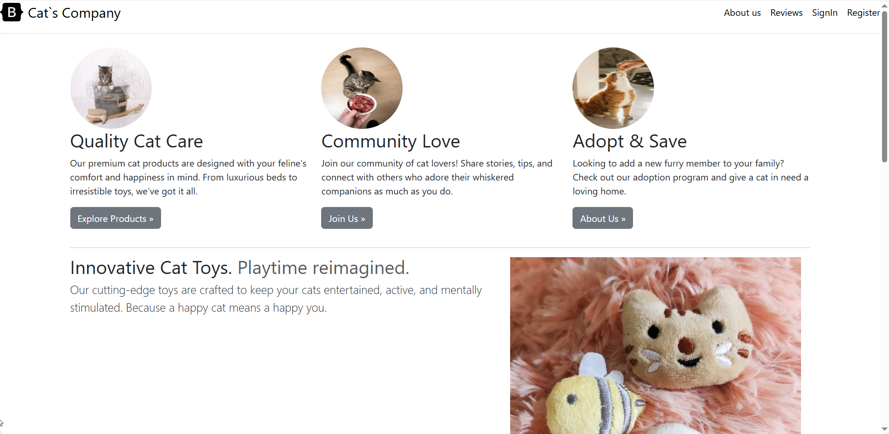

- `about.blade.php`

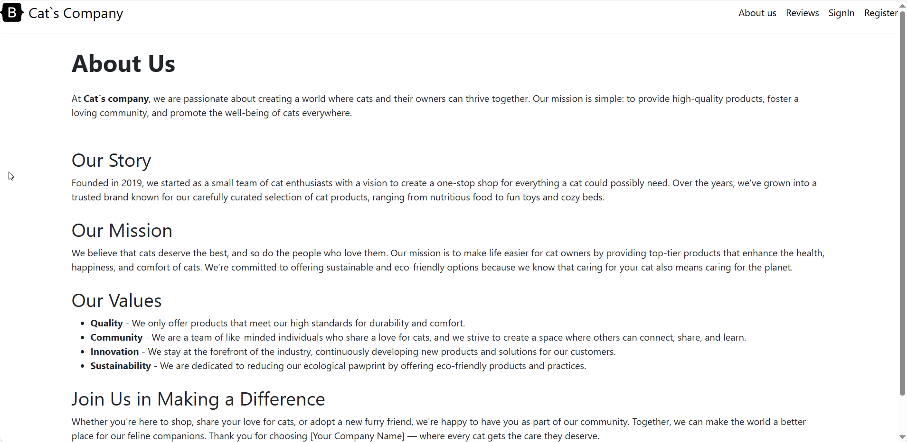

- `review.blade.php`

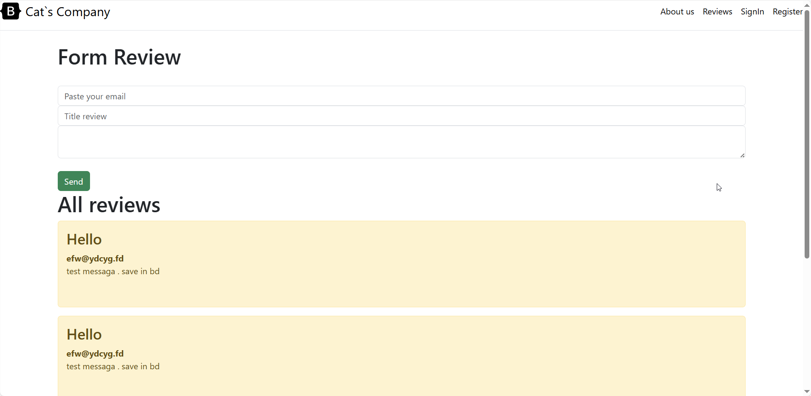

- `singin.blade.php`

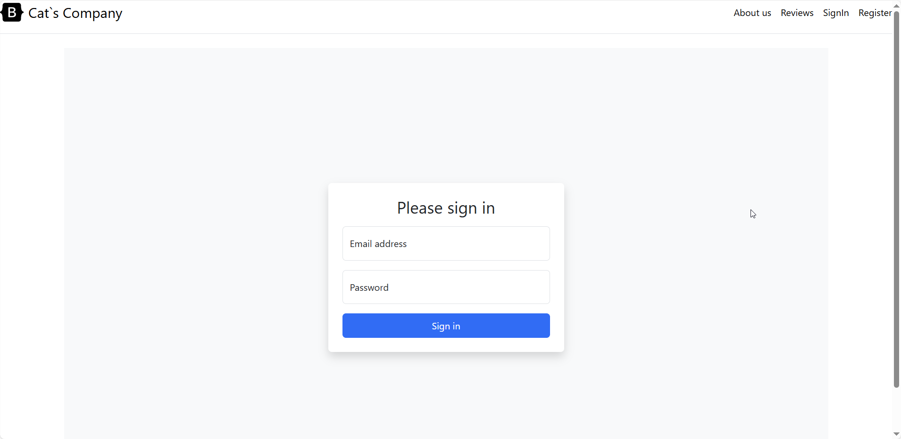

- `register.blade.php`

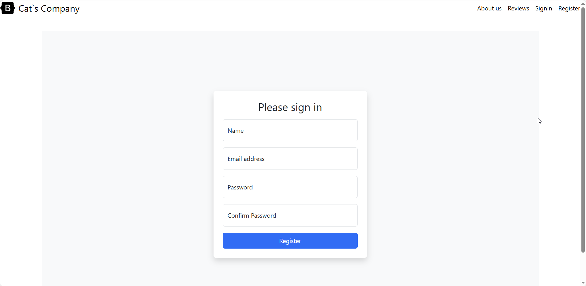

- `categories.blade.php`

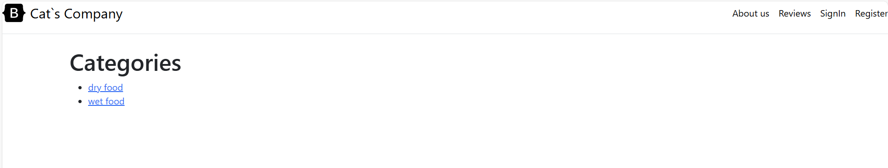

- `products.blade.php`

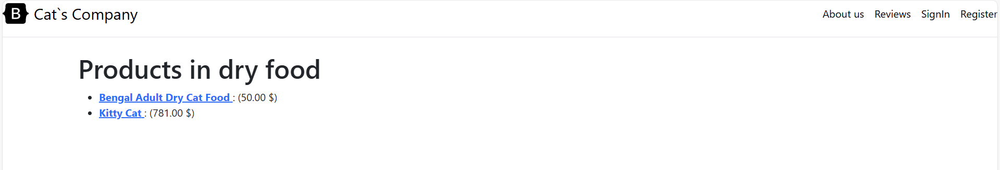

- `products.add.blade.php`

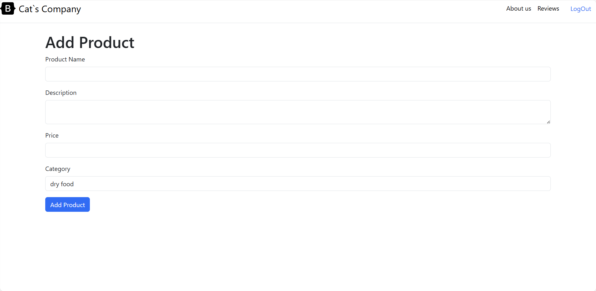

- `products.show.blade.php`

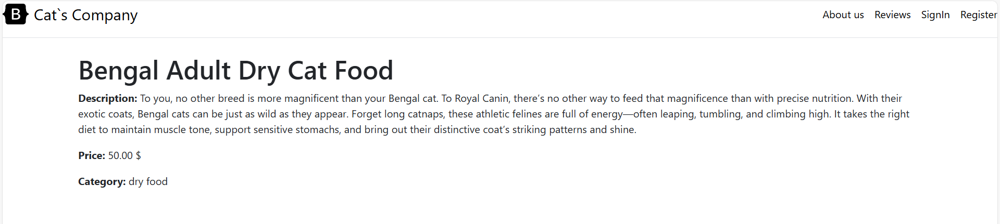

- `cart\index.blade.php`

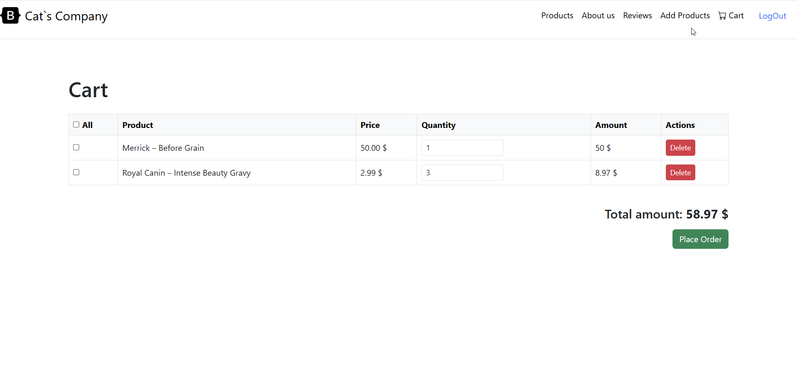

- `order.blade.php`

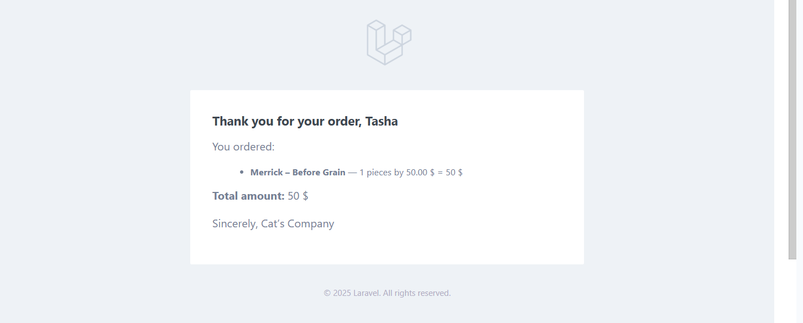

## Использованные источники

1. [Официальная документация Laravel](https://laravel.com/docs/10.x)
2. [Документация PHP](https://www.php.net/)
3. [Обучение на YouTube](https://www.youtube.com/watch?v=0Be0fX9wbXc&t=96s)

---

## Прочие аспекты

- **Безопасность**: Используются middleware для защиты маршрутов, связанных с добавлением продуктов.
- **Валидация**: Все формы содержат строгую серверную валидацию.
- **Дизайн**: Поддержка чистого и удобного интерфейса для пользователя.